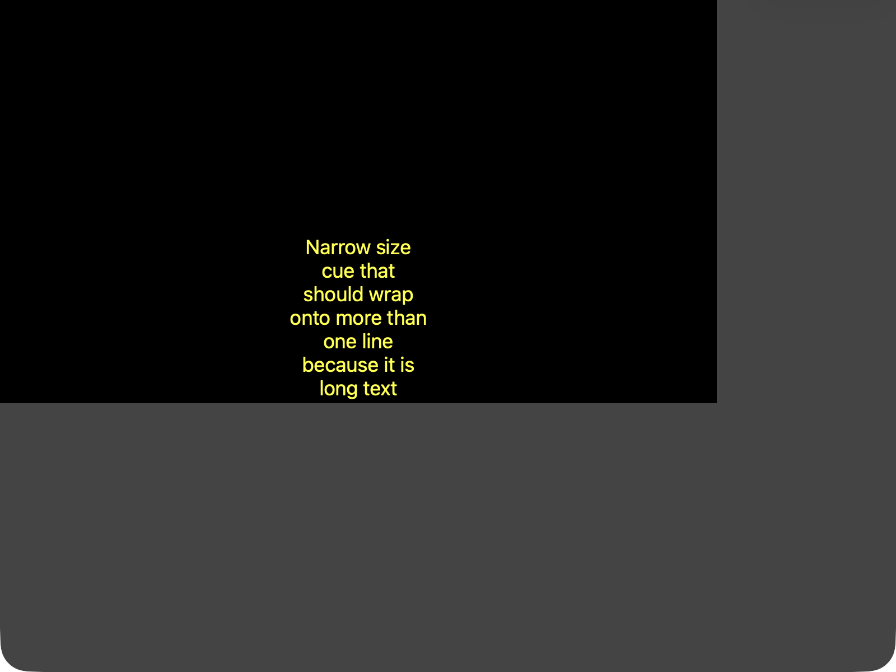

[Tables](tables.md) · [Source on GitHub](https://github.com/hartman/webvtt-browser-support)

# The state of Native WebVTT, as tested against real browsers

*Tested in July/August 2026 against Chrome 151, Firefox 153, Safari 26.6, Safari Technology Preview 27.0, iOS Safari 26.5 (Simulator), and video.js 8.23.9.*

## TL;DR

- **Safari and Safari Technology Preview** implement the spec most completely and consistently.
- **Chrome** deviates in specific, deliberate ways: no regions at all.
- **Firefox** deviates significantly: it doesn't really allow styling per cue at all.
- **iOS Safari** tracks desktop Safari's spec compliance exactly, no divergence found.
- video.js's own renderer isn't spec-compliant either, and turning it off costs little, so you probably should.

Skip straight to the [full findings](#the-big-picture-browser-by-browser) below, or the [tables page](tables.md) for the complete matrix.

## Background
I've long been interested in WebVTT. Or maybe I should say the _promise_ of WebVTT, because so far usage is lower than expected and browser behavior is rather unpredictable.
Ever since 2012 when Wikipedia got its first HTML5 player ([mwEmbed](https://www.mediawiki.org/wiki/Extension:MwEmbedSupport/MwEmbed), based on [Kaltura's player](https://kaltura.com)), I've been playing around with HTML5 subtitles for Wikipedia.
Due to how in-flux the standards were back then, we settled on simple SubRip SRT subtitles (SubRip was the basis of WebVTT) with hopes to soon upgrade to WebVTT proper.

When the standard moved on, we eventually added an SRT to WebVTT conversion pipeline, but Wikipedia never allowed contributors to author in WebVTT and thus the ability to use any of the advanced features never materialized.
And the reasons for this were manifold. First, with the more advanced features of WebVTT, validation of the user-contributed input became harder. We needed a PHP parser advanced enough to handle that.
But also... it seemed that a lot of the potential features of WebVTT didn't really materialize in browsers very well and definitely not consistently. This made investing into code to handle it risky.
The WebVTT renderer of VideoJS helped us forward somewhat to bypass the browser differences, but I just never found the time to properly return to the topic.

That's up till this year, where I finally found time to wrap up the important parts of my PHP parser for WebVTT called [vtt-vivid](https://github.com/hartman/vtt-vivid).
And this made me curious... Where ARE we with browser native support for WebVTT ? Can I turn off the WebVTT renderer of video.js ?
It was hard to find good information on this topic. And now that we have AI, I figured it should be much easier to simply 'find out'.

So with the assistance of Sonnet and Opus, I created a testing setup where the AI would write VTT testcases based on things it found in the specification.
It then used WebDriver and Appium to test each of the browsers available to me on my Mac to make screenshots, analyze the screenshots and verify behavior at a scale that otherwise, I would not have had the perseverance to see completely through.
All this was then compiled into this report.

## The big picture, browser by browser

- **Chrome** styles cues well but has no region support whatsoever.
- **Firefox** can position and size cues correctly, but it supports none of the selectors for `::cue()` making styling support rather useless.
- **Safari and Safari Technology Preview** are, overall, the most complete and consistent of the four. Dare I say... nearly feature complete?
- **iOS Safari** (Simulator) matched desktop Safari on everything tested.

Read on for some more highlighted findings or skip straight to the [tables page](tables.md) for the complete matrix.

## Karaoke styling with `:past`/`:future` only works if you wrap your text

Some of the online documentation, like MDN's compat data, listed `:past`/`:future` as supported in Chrome since version 23 and Safari since version 7, for karaoke-style highlighting when combined with cue timestamp tags. However, the documentation on HOW to actually use this is severely lacking, and I had trouble finding any examples online.
My first test put internal timestamps directly between plain words:

```vtt
00:00:00.000 --> 00:00:05.000
<00:00:01.000>One<00:00:02.000> Two<00:00:03.000> Three<00:00:04.000> Four
```

Nothing happened in any browser — no color split between "past" and "future" words, in Chrome, Firefox, Safari, or Safari TP.
I initially concluded `:past`/`:future` just weren't implemented anywhere and moved on.

But this turned out to be incorrect. Some further web researching turned up a [2012 mailing list thread](https://lists.w3.org/Archives/Public/public-texttracks/2012Apr/0146.html), stating that `::cue()`'s selector argument can only ever match *elements*, never bare text.
My plain-text cue had no elements in it to match. From a pure browser point of view, this makes perfect sense, but I had simply never seen this working, and it wasn't obvious to me from the specification that this is how it was supposed to be used.
After wrapping each word in its own `<c>` span they suddenly behave as expected.

```vtt
WEBVTT

STYLE
::cue(c:past) { color: lime; }
::cue(c:future) { color: red; }

00:00:05.000 --> 00:00:10.000
<c>One</c><00:00:06.000><c> Two</c><00:00:07.000><c> Three</c><00:00:08.000><c> Four</c>
```

| Chrome | Firefox |
|---|---|
|  |  |

I find this a rather user-unfriendly way of doing things. Counterintuitive and likely responsible for lower usage of this feature than we had all expected. The specification should be much clearer I think on how browsers should implement this Karaoke/Lyrics behavior, and clearer on how users should be using it.

Chrome, Safari, and Safari TP all render this correctly once the text is wrapped. Firefox still shows no split at all, but that's the next finding.

## Firefox silently ignores every `::cue(selector)` form

Class selectors, voice selectors, tag selectors, id selectors, `:lang()` — none of them do anything in Firefox. Only bare `::cue { }` with no argument works.
It makes styling in Firefox practically useless. This is a known bug [Bugzilla #1321489](https://bugzilla.mozilla.org/show_bug.cgi?id=1321489), filed back in 2016.

## Chrome dropped VTTRegion support entirely

`VTTRegion` is `undefined` in Chrome.
A cue with a `region` attribute doesn't error, it just silently falls back to ordinary, non-regioned cue layout, ignoring `width`, the anchor points, and `scroll:up`.
This too is a known bug and [crbug.com/41267398](https://issues.chromium.org/issues/41267398) tracks this, along with the missing `positionAlign`/`lineAlign` properties.

Firefox, Safari, and Safari TP all implement regions properly, and this missing support is responsible for Chrome actually scoring lower than I was expecting.

## Chrome doesn't wrap cue text inside a narrow `size` at all

```vtt
00:00:08.000 --> 00:00:10.000 line:84% position:50% align:center size:20%
Narrow size cue that should wrap onto more than one line because it is long text
```

| Chrome | Safari |
|---|---|
|  |  |

Firefox, Safari, and Safari TP all wrap correctly, respecting `align`. Yet Chrome just overflows past the `size:20%` box as a single line.
I couldn't find an existing Chromium bug matching this exact problem.

## Firefox doesn't support vertical writing mode

```vtt
00:00:10.000 --> 00:00:12.000 vertical:rl line:84% position:50% align:center
Vertical RL text
```

| Chrome | Firefox |
|---|---|
|  |  |

Firefox doesn't appear to implement vertical writing mode for cues in either direction (`rl` or `lr`) — it just repositions the horizontal text near the edge instead of rotating it.

## Firefox terminates a `NOTE` block one line too early

Per spec, a `NOTE` block should keep consuming lines until a blank line or end-of-file, so a cue identifier placed directly after a `NOTE` line, with no blank line in between, should get swallowed into the note, leaving the following cue anonymous. Chrome, Safari, and Safari TP all do this correctly (the cue's `.id` comes back empty). Firefox instead stops consuming the `NOTE` after just its own line and parses the next line as a real cue identifier. A genuine parser deviation from spec, not a rendering quirk, confirmed via a direct `TextTrack.cues` dump.

## A few smaller things worth knowing

- `::cue(#id)`, styling one specific cue by its id, only works in Safari **Technology Preview**, not stable Safari, Chrome, or Firefox.
- `ruby-position: under` is ignored by all four desktop browsers; the annotation stays above the base text everywhere, even where it's on MDN's list of permitted `::cue` properties.
- Chrome silently drops a bare `::cue { background-color }` rule (no argument selector), while `color` on that same rule still applies.
- `positionAlign`/`lineAlign`'s comma-suffixed syntax (`position:10%,line-left`, `line:50%,end`) is genuinely in the current spec, but it's under live dispute. An open issue ([w3c/webvtt#440](https://github.com/w3c/webvtt/issues/440)) argues it should be removed entirely, since Chrome's first attempt at implementing it broke already-deployed subtitle content and had to be reverted. Chrome's own feature-tracking entry now reads "no longer pursuing," pending that dispute being resolved. It isn't simply unfinished. Firefox, Safari, and Safari TP all implement it as currently written anyway.
- `::cue-region()` styling, bare or by id, doesn't work in any browser. The `<region>` layout mechanism itself works fine in 3 of 4; only the CSS hook to style the region box is unimplemented everywhere.
- Where you declare your `::cue()` rules matters, at least for one property: `background-image` renders correctly when it's in a page-level `<style>` block or an external stylesheet, but does nothing at all in Safari and Safari TP when the identical rule sits inside the `.vtt` file's own `STYLE` block, which is otherwise the more realistic way to ship self-contained subtitle files. Chrome and Firefox behave the same regardless of where the rule lives.

## So, can I turn off video.js's renderer?

This is the question that started this whole project (see the Background section above).

Short answer: **probably, yes.** Native rendering is closer to specification. video.js 8.23.9 itself implements zero VTT CSS styling, so switching gains `::cue()` styling on Chrome/Safari/Safari TP and regions on Firefox/Safari, at the cost of reinheriting Chrome's bugs in a few rarely used cue-settings (narrow-`size` wrapping, `positionAlign`/`lineAlign`, vertical writing mode) that video.js currently sidesteps.

The [tables page](tables.md) has the full video.js comparison table, plus the complete native-browser feature matrix: every property, every selector form, every cue-settings combination tested.

The raw fixtures, screenshots, and JSON pixel-sample data behind every claim here are in the [GitHub repo](https://github.com/hartman/webvtt-browser-support), if you want to check my work or re-run it yourself.
